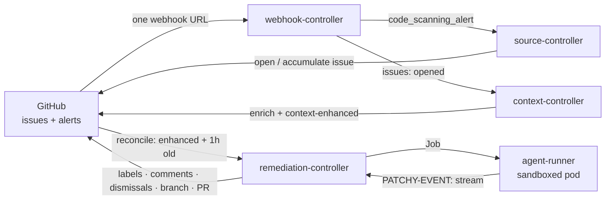

# How it works

Patchy is five Go binaries sharing one source of truth: the GitHub issue. Labels carry the state, transitions are
visible on the issue that caused them, and there is no shadow database or queue. Each component owns a narrow set of
transitions, and no label key has two writers.

Webhooks enter through one door: the GitHub App's single webhook URL points at the **webhook-controller**, which
validates the HMAC signature and routes each delivery to the controllers that consume its event type — event types no
route claims default to the source-controller, and every controller re-validates the signature itself. The
webhook-controller holds no GitHub credential, so the components carrying the App's key never face the internet.

## 1. Findings arrive and accumulate

The **source-controller** receives `code_scanning_alert` webhooks, fetches the alert detail, and opens a GitHub issue
carrying the finding's manifest: the alert body, the advisory identifiers (CWE/CVE/GHSA), and the initial labels —
`security-finding: opened`, `security-accumulation: open`, `security-source`, `security-advisory`, `security-alert`.

Multiple alerts of the same advisory type against the same repository are one weakness, not many. For the **accumulation
window** (one hour by default) they fold into the same issue: the body's machine manifest grows and each alert adds a
`security-alert: <n>` label. When the issue is older than the window, the reconcile pass flips
`security-accumulation: open → complete`, releasing it downstream. Alerts arriving later open a fresh issue.

## 2. Context before code

The **context-controller** reacts to `security-finding: opened` issues (webhook first, with a reconcile sweep for
anything the webhook missed after a 2-minute grace). It runs the enhancer chain — ownership and infrastructure context,
posted as a comment so the accumulator keeps sole ownership of the issue body — and flips the state to
`context-enhanced`. The built-in enhancer is a YAML-backed static map (a stand-in for a real CMDB); the
[`pkg/enhance`](extending.md) seam takes real integrations.

## 3. Pickup is deliberate, not eager

The **remediation-controller**'s reconcile loop — not a webhook — picks up issues that are `context-enhanced`, have
`accumulation: complete`, and are older than `--issue-min-age` (one hour). The age gate is the design's patience: it
guarantees the accumulation window has done its work before any tokens are spent.

Pickup writes `security-finding: classifying` _before_ the Job exists — the label is the lease. If the Job fails to
launch, the label reverts to `context-enhanced` and the next pass retries, up to `--max-attempts` (2) tracked in
`security-attempts`. Then it mints an ephemeral Kubernetes Job in the agent namespace.

## 4. The sandboxed agent

The Job is the isolation boundary (detailed in [Deployment → Isolation model](deployment/isolation.md)):

- An **init container** clones the repository — a tag-free, depth-1 fetch pinned to the exact default-branch commit the
  controller resolved — using a short-lived, single-repo, read-only token from a per-Job Secret, then unsets it. The
  credential never survives into the agent container.
- The **agent container** runs `agent-runner` with no GitHub credentials and no Kubernetes API access; network egress is
  limited to the model API. Its inputs are the cloned repo, a templated `issue.md`, and `PATCHY_*` env config.

Inside the pod, `agent-runner` runs a two-stage flow via `claude -p`:

1. **Classify** — is this a false positive? Can it be remediated safely? The agent writes a report with YAML
   frontmatter: `recommendation` (`ignore` | `remediate` | `manual`), `priority`, `severity`, `confidence` (0–1), and —
   for `remediate` — the `model`, `max_turns` and `token_budget` it wants.
2. **Remediate** — only when the recommendation is `remediate`, confidence clears the threshold (0.75), and no
   breaking-change hold applies. The stage runs under the requested budget (clamped to the controller's ceilings, with a
   live output-token kill switch) and produces a remediation report plus a structured changeset — the changed files'
   contents, diffed against the pinned base commit.

The runtime never talks to GitHub. Results leave the pod as a `PATCHY-EVENT:` JSONL stream on stdout, which the
remediation-controller tails from the pod log.

## 5. Side effects, all in one place

The remediation-controller is the **only** component that writes GitHub side effects from agent results. Per the
classification event it stamps the verdict labels (severity, priority, recommendation, confidence, usage) and routes:

| Outcome                                           | Action                                                                    |
| ------------------------------------------------- | ------------------------------------------------------------------------- |
| `ignore` (false positive)                         | Dismiss every accumulated GHAS alert as _false positive_, close the issue |
| `manual`                                          | Assign the repository owners                                              |
| `remediate`, confidence < threshold               | Assign owners + `/approve` instructions                                   |
| `remediate`, a better-but-breaking fix exists     | Hold for `/approve` — a human accepts the compatible fix explicitly       |
| `remediate`, confidence ≥ threshold               | Continue: the same pod's remediation stage runs                           |
| Stage failed (timeout, budget, invalid report, …) | Route to humans (`manual`), never trust a partial report                  |

On remediation success it replays the changeset through the GitHub API (blob → tree → commit → ref) with a scoped write
token — no git binary, no clone — creating branch `patchy/issue-<n>`, opens the pull request, and sets `in-review`. A
maintainer's `/approve` comment on a held issue re-runs a remediate-only Job, reusing the classification report from the
issue comment.

## 6. Humans close the loop

Merging the PR fires a `pull_request` webhook: the issue flips to `remediated` and closes. Closing the PR unmerged — or
exhausting retries anywhere above — lands the issue at `attempted` with `security-recommendation: manual` and the owners
assigned. Both are terminal: every finding ends either repaired or explicitly in human hands.

The complete legal-transition table, with writers, lives in [Labels & state machine](labels.md).
