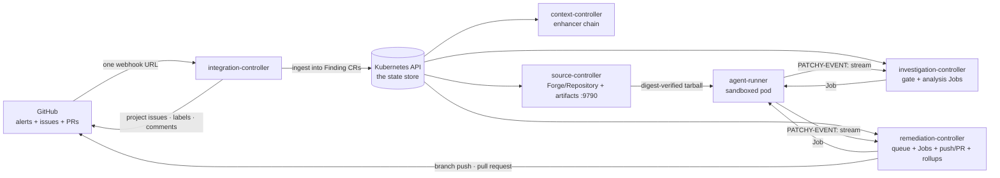

# How it works

Patchy is six Go binaries sharing one source of truth: the Kubernetes API. The `patchy.bitwisemedia.uk/v1alpha1` custom
resources — `Integration`, `Forge`, `Finding`, `Repository`, `Investigation`, `Remediation`, `FindingRollup` — carry all
pipeline state; etcd is the only state store, and there is no shadow database or queue. GitHub issues are a **one-way,
human-facing projection**: labels and comments are rendered from the Finding, and human actions flow back in as webhook
signals, never by re-parsing issue state.

Webhooks enter through one door: the GitHub App's single webhook URL points at the **integration-controller**'s
`/github/webhooks` receiver, which validates each delivery against the webhook secrets of your configured `Integration`
resources. No other controller faces the internet, and no other controller serves a webhook. Pipeline progress is
**not** webhook-driven — the gates ("accumulation closed", "older than an hour", "a free remediation slot") are
conditions no event can announce, so the controllers' watch-driven reconcile loops carry the pipeline; the webhook path
is ingestion and human-in-the-loop signals only.



Two namespaces, and the split is the security boundary: the five controllers run in `patchy` (single replicas, leader
election as rollout insurance), and the ephemeral agent Jobs run in `patchy-agents`, which holds exactly one secret —
the model API key. See the [isolation model](deployment/isolation.md).

## 1. Findings arrive and accumulate

The **integration-controller** validates each `code_scanning_alert` delivery and hands it to the matching
[`pkg/source` handler](extending.md), which normalizes the alert into advisories (GHSA/CVE/CWE), severity, and
locations. The result is folded into a `Finding` resource: a new one at phase `Opened` for a first alert, or — for the
**accumulation window** (one hour by default) — merged into the existing Finding for the same repository and advisory
family. Accumulation is a condition (`AccumulationComplete`), not a phase, so alerts keep folding in while enhancement
runs concurrently. Alerts arriving after the window close open a fresh Finding.

## 2. The tracking issue is a projection

The same controller projects every Finding out as a GitHub tracking issue — body, enrichment and report comments, and a
trimmed [label vocabulary](labels.md#the-projected-labels) (source, advisories, phase, severity, priority,
recommendation). The projection is one-way: nothing ever parses issue state back into the pipeline. Human signals do
flow back — an issue closed by a human hands the finding off, a `/approve` comment releases a held finding, and the PR
merge webhook completes it.

## 3. Context before code

The **context-controller** watches for `Opened` findings and runs the enhancer chain — ownership and infrastructure
context recorded as enrichments on Finding status (projected as issue comments by the integration-controller), then the
`Opened → Enhanced` transition. It holds no GitHub credential and makes no external calls at all. The built-in enhancer
is a YAML-backed static map (a stand-in for a real CMDB); the [`pkg/enhance`](extending.md) seam takes real
integrations.

## 4. Repositories are pinned once

The **source-controller** runs the `Forge` and `Repository` reconcilers: it validates forge credentials, resolves each
Repository to its covering `Forge`, pins the head SHA exactly once, downloads the tarball archive at that SHA over plain
HTTP (no git binary anywhere controller-side), and serves it from an in-cluster artifact endpoint (`:9790`). Agent pods
fetch it **credential-lessly** — the URL carries an unguessable id and the Job pins the sha256 digest — so investigation
and remediation are guaranteed the same code.

## 5. The gate, then the investigation

The **investigation-controller** admits findings that are `Enhanced`, have a closed accumulation window, and are older
than `--finding-min-age` (one hour) — the age gate is the design's patience. Admission materializes the `Repository` and
one immutable `Investigation` per attempt (the child create is the lease), then the analysis scheduler runs agent Jobs
under bounded concurrency in severity order.

Inside the pod, **agent-runner** drives `claude -p` over the pinned tree and a templated finding handoff. The agent
writes a report with parseable YAML frontmatter: `exploitability`, `likelihood`, and `impact` ratings, a
`recommendation` (`ignore` | `remediate` | `manual`), `severity`, `priority`, a `confidence` value in [0, 1], and — for
`remediate` — the model, turn count, and token budget it wants for the fix (clamped later to operator ceilings and a
model allowlist). Backwards-compatible fixes are always favoured; if a better-but-breaking fix exists, the report says
so and the pipeline holds for a human `/approve`. The runtime never talks to GitHub or the Kubernetes API — results
leave the pod as a `PATCHY-EVENT:` JSONL stream on stdout.

## 6. Verdicts route

The investigation-controller stamps the results onto the Finding (the report is projected onto the tracking issue, and
the ratings feed a 0–100 scheduling priority) and routes:

| Verdict                                                 | Route                                                                            |
| ------------------------------------------------------- | -------------------------------------------------------------------------------- |
| `ignore` (false positive)                               | Dismiss the accumulated alerts, close the issue — `Dismissed`                    |
| `manual`                                                | Hand to the repository owners — `HandedOff` (revivable by `/approve`)            |
| `remediate`, confidence < threshold, or a breaking hold | `AwaitingApproval` — a human `/approve` comment releases it                      |
| `remediate`, confidence ≥ threshold (0.75)              | `Queued` for remediation                                                         |
| Stage failed (timeout, budget, invalid report, …)       | Retry within `--max-attempts`, then `Failed` — a partial report is never trusted |

## 7. Remediation in priority order

The **remediation-controller** admits queued findings (including approvals and revivals), schedules them in priority
order under bounded concurrency (with aging so low-priority findings cannot starve), and runs the second agent stage:
the finding markdown, the same pinned tree, and the investigation report, under the clamped budget. The agent emits a
summary report plus a `commit.sh` that must run cleanly and leave real commits — the claim is verified, not believed.

The controller — the only holder of a forge **write** credential — then replays the changeset through the GitHub Git
Data API (blob → tree → commit → ref) onto a `patchy/<finding>` branch, opens the pull request, and moves the finding to
`InReview`.

## 8. Humans close the loop

Merging the PR fires a `pull_request` webhook: the integration-controller moves the finding to `Remediated`. Closing the
PR unmerged, or exhausting retries anywhere above, lands it at `Failed`; `manual` verdicts and human-closed issues land
at `HandedOff`, which a later `/approve` can revive back into the queue. Completed findings are kept for a TTL (14 days
by default) and then deleted; per-scope `FindingRollup` resources retain the all-time statistics — success rates,
verdict mix, token and cost totals per repository, harness, and model.

Watch it all with the shared kubectl category:

```sh
kubectl get patchy -n patchy          # everything patchy owns
kubectl get findings -w               # the pipeline, live
kubectl get investigations,remediations,findingrollups
```

The complete phase table, with writers, lives in [State machine & labels](labels.md).
