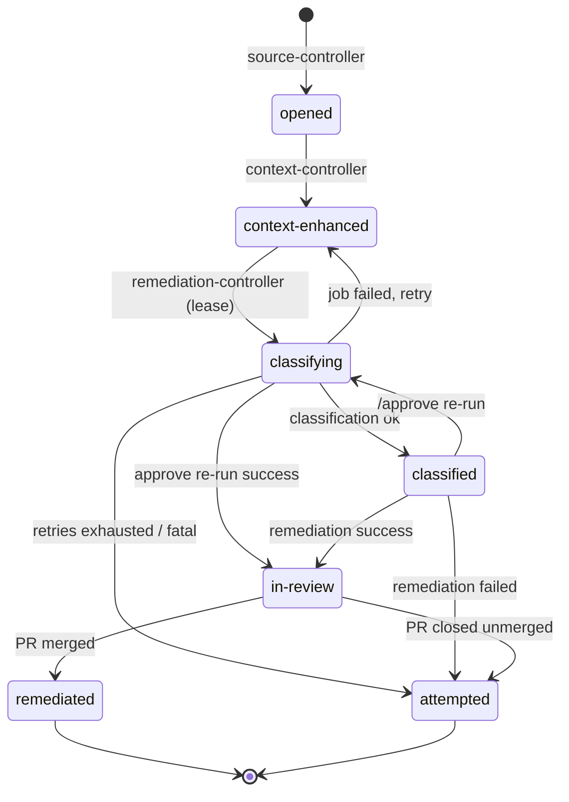

# Labels & state machine

The `internal/labels` package is the single source of truth for label names, value formats, and legal transitions. Every
patchy label renders as `<key>: <value>` — key, colon-space, value — truncated to GitHub's 50-character label cap. Full
metadata that a label abbreviates (the complete classification report, say) lives in report-comment YAML frontmatter,
not in labels.

Patchy only adds and removes labels inside the `security-` namespace; it never touches foreign labels, and unknown or
malformed `security-*` labels are ignored rather than wedging the pipeline. Labels are created by the GitHub API on
first use — patchy does not manage label colors or descriptions.

## Label keys

<div class="nowrap-first" markdown>

| Key                                  | Cardinality             | Written by             | Meaning                                                     |
| ------------------------------------ | ----------------------- | ---------------------- | ----------------------------------------------------------- |
| `security-source`                    | single                  | source-controller      | Finding source, e.g. `ghas`                                 |
| `security-advisory`                  | multi (one per id)      | source-controller      | CWE/CVE/GHSA identifiers; the primary one keys accumulation |
| `security-alert`                     | multi (one per alert)   | source-controller      | Each accumulated GHAS alert number                          |
| `security-finding`                   | single                  | per-transition owner   | **The lifecycle state** (below)                             |
| `security-accumulation`              | single                  | source-controller      | `open` \| `complete` — the 1-hour window gate               |
| `security-severity`                  | single                  | remediation-controller | `low` \| `medium` \| `high` \| `critical`                   |
| `security-priority`                  | single                  | remediation-controller | `low` \| `medium` \| `high` \| `critical`                   |
| `security-recommendation`            | single                  | remediation-controller | `remediate` \| `ignore` \| `manual`                         |
| `security-recommendation-confidence` | single                  | remediation-controller | 0–1 float, ≤ 4 decimals, e.g. `0.75`                        |
| `security-token-budget`              | single (remediate only) | remediation-controller | Output-token budget granted to remediation                  |
| `security-max-turns`                 | single (remediate only) | remediation-controller | Turn ceiling granted to remediation                         |
| `security-attempts`                  | single                  | remediation-controller | Agent-Job retry counter                                     |
| `security-classifier`                | single                  | remediation-controller | Harness that classified, e.g. `claude`                      |
| `security-remediator`                | single                  | remediation-controller | Harness that remediated                                     |

</div>

Two usage-label families record what each stage cost, one label per metric — `input-tokens`, `output-tokens`, `turns`,
`cost`, `session` (truncated to 8 characters), and `elapsed` (rendered like `12.4s`):

```text
security-classification-input-tokens: 48211     security-remediation-input-tokens: 195402
security-classification-output-tokens: 9120     security-remediation-output-tokens: 88031
security-classification-turns: 14               security-remediation-turns: 61
security-classification-cost: 0.87              security-remediation-cost: 6.12
security-classification-session: 1c2f9a3d       security-remediation-session: 9b7e21c4
security-classification-elapsed: 312.7s         security-remediation-elapsed: 1804.2s
```

## The `security-finding` states

<div class="nowrap-first" markdown>

| State              | Meaning                                                               |
| ------------------ | --------------------------------------------------------------------- |
| `opened`           | Issue created from the first alert; accumulating                      |
| `context-enhanced` | Ownership / infrastructure context added                              |
| `classifying`      | Agent Job leased (the label **is** the lease)                         |
| `classified`       | Verdict labels stamped; route chosen                                  |
| `in-review`        | Remediation branch pushed, pull request open                          |
| `remediated`       | PR merged; issue closed. **Terminal**                                 |
| `attempted`        | Agent exhausted or PR closed unmerged; handed to humans. **Terminal** |

</div>

## Legal transitions

Self-transitions are always legal no-ops; everything else is refused by the controllers. Per-transition ownership means
no state edge has two writers.



<div class="nowrap-first" markdown>

| From               | To                 | Writer                 | Trigger                                                        |
| ------------------ | ------------------ | ---------------------- | -------------------------------------------------------------- |
| _(none)_           | `opened`           | source-controller      | First alert of an advisory type for the repository             |
| `opened`           | `context-enhanced` | context-controller     | `issues` webhook or reconcile sweep after the 2m grace         |
| `context-enhanced` | `classifying`      | remediation-controller | Reconcile: `accumulation: complete` ∧ older than min age       |
| `classifying`      | `classified`       | remediation-controller | Classification event applied (verdict labels stamped)          |
| `classifying`      | `context-enhanced` | remediation-controller | Job launch failed / recoverable failure with attempts left     |
| `classifying`      | `in-review`        | remediation-controller | `/approve` remediate-only re-run succeeded                     |
| `classifying`      | `attempted`        | remediation-controller | Attempts exhausted or fatal agent outcome                      |
| `classified`       | `classifying`      | remediation-controller | `/approve` comment by an owner/member/collaborator             |
| `classified`       | `in-review`        | remediation-controller | Same-pod remediation success (branch pushed, PR opened)        |
| `classified`       | `attempted`        | remediation-controller | Same-pod remediation failure                                   |
| `in-review`        | `remediated`       | remediation-controller | `pull_request` closed with `merged=true` on `patchy/issue-<n>` |
| `in-review`        | `attempted`        | remediation-controller | Remediation PR closed unmerged                                 |

</div>

The `security-accumulation` transition (`open → complete`) is owned solely by the source-controller and runs in parallel
with the early states, gated on issue age against the accumulation window.

## Classification taxonomy and routing

The agent's report frontmatter speaks a three-word vocabulary — `ignore` (false positive), `remediate` (automated fix
likely to succeed), `manual` (real, but a human must handle it) — the same values the `security-recommendation` label
carries, so the report and the issue never need translating. Confidence is the probability the finding can be fully
remediated **without breaking functionality**; backwards-compatible fixes are always preferred, and when a
better-but-breaking fix exists the compatible one waits for an explicit `/approve`.

| Classification result             | Route                                                               |
| --------------------------------- | ------------------------------------------------------------------- |
| `ignore`                          | Dismiss all accumulated GHAS alerts (_false positive_), close issue |
| `manual`                          | Assign repository owners                                            |
| `remediate`, confidence < 0.75    | Assign owners + `/approve` instructions                             |
| `remediate`, breaking-change hold | Assign owners + `/approve` instructions                             |
| `remediate`, confidence ≥ 0.75    | Remediation stage runs in the same pod                              |
| Stage outcome not `ok`            | `manual`, assign owners — a partial report is never trusted         |

Stage outcomes other than `ok` — `runtime_error`, `timeout`, `budget_exceeded`, `report_missing`, `report_invalid`,
`commit_failed`, `changeset_too_large` — always route to humans.

`/approve` is honoured from comment authors whose association is `OWNER`, `MEMBER`, or `COLLABORATOR`.
