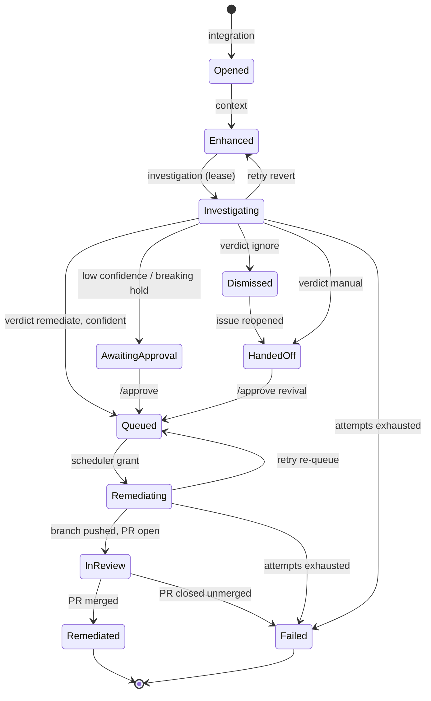

# State machine & labels

The `Finding` custom resource is the authoritative state machine for one security finding. `api/v1alpha1` owns the phase
taxonomy and the legal transition table (`transitions.go`), every phase edge has exactly one writer component, and
`SetPhase` refuses illegal moves — a controller cannot accidentally invent a transition. Labels on the tracking issue
are a **one-way projection** of this state for humans and issue searches; nothing ever parses them back.

## Phases

`Finding.status.phase` walks the happy path
`Opened → Enhanced → Investigating → Queued → Remediating → InReview → Remediated`, with `AwaitingApproval` before
`Queued` when a human must approve, and `Dismissed` / `HandedOff` / `Failed` as the other terminal phases. `Queued` is a
real phase — remediation runs in priority order with bounded concurrency, so findings observably wait for a slot.

<div class="nowrap-first" markdown>

| Phase              | Meaning                                                                                 |
| ------------------ | --------------------------------------------------------------------------------------- |
| `Opened`           | Ingested from the first alert; accumulating, awaiting enhancement                       |
| `Enhanced`         | The enhancer chain ran; ownership / infrastructure context recorded                     |
| `Investigating`    | An `Investigation` child exists (the child create is the lease); analysis Job runs      |
| `AwaitingApproval` | Verdict is `remediate` but below the confidence threshold, or a breaking-change hold    |
| `Queued`           | Admitted to the remediation queue; waiting for a priority-ordered slot                  |
| `Remediating`      | A `Remediation` child holds a slot; the remediation Job runs                            |
| `InReview`         | Branch pushed, pull request open; humans review                                         |
| `Remediated`       | PR merged. **Terminal**                                                                 |
| `Failed`           | Retries exhausted, fatal stage outcome, or PR closed unmerged. **Terminal**             |
| `Dismissed`        | Investigation verdict `ignore`: alerts dismissed, issue closed. **Terminal**, revivable |
| `HandedOff`        | Verdict `manual`, or a human closed the tracking issue. **Terminal**, revivable         |

</div>

Terminal entry sets `status.completedAt`, which starts the [finding TTL](configuration/remediation-controller.md)
(default 14 days — the `FindingRollup` objects retain the statistics after deletion). `Dismissed` and `HandedOff` are
revivable terminals: reopening the issue moves `Dismissed → HandedOff`, and a `/approve` comment moves
`HandedOff → Queued`, clearing `completedAt` and cancelling the TTL.

## Legal transitions

Self-transitions are always legal no-ops; everything else is refused by `SetPhase`. Per-edge ownership means no phase
edge has two writers.



Every non-terminal phase additionally has an edge to `HandedOff`, written by the integration-controller when a human
closes the tracking issue — a person can always pull a finding out of the machine's hands.

<div class="nowrap-first" markdown>

| Edge                                                                                   | Writer                   | Trigger                                                              |
| -------------------------------------------------------------------------------------- | ------------------------ | -------------------------------------------------------------------- |
| _(none)_ → `Opened`                                                                    | integration-controller   | First alert of an advisory family for a repository                   |
| `Opened` → `Enhanced`                                                                  | context-controller       | Enhancer chain completed                                             |
| `Enhanced` → `Investigating`                                                           | investigation-controller | Gate admits (accumulation closed ∧ min age); `Investigation` created |
| `Investigating` → `Enhanced`                                                           | investigation-controller | Recoverable Job failure with attempts left                           |
| `Investigating` → `Queued` / `AwaitingApproval` / `Dismissed` / `HandedOff` / `Failed` | investigation-controller | Verdict routing                                                      |
| `AwaitingApproval` → `Queued`, `HandedOff` → `Queued`                                  | remediation-controller   | Accepted `/approve` (approval / revival)                             |
| `Queued` → `Remediating`                                                               | remediation-controller   | Priority scheduler grants a slot                                     |
| `Remediating` → `Queued`                                                               | remediation-controller   | Recoverable failure re-queued                                        |
| `Remediating` → `InReview` / `Failed`                                                  | remediation-controller   | Push + PR succeeded / attempts exhausted                             |
| `InReview` → `Remediated` / `Failed`                                                   | integration-controller   | `pull_request` webhook: merged / closed unmerged                     |
| `Dismissed` → `HandedOff`                                                              | integration-controller   | Human reopened the tracking issue                                    |
| any non-terminal → `HandedOff`                                                         | integration-controller   | Human closed the tracking issue                                      |

</div>

## Conditions

Facts that are not phases ride on `status.conditions`. Accumulation is the important one: alerts keep folding into a
Finding **while** enhancement runs, so the window close cannot be a phase.

<div class="nowrap-first" markdown>

| Condition                                               | On                         | Meaning                                                                                                     |
| ------------------------------------------------------- | -------------------------- | ----------------------------------------------------------------------------------------------------------- |
| `Ready`                                                 | every kind                 | The summary condition                                                                                       |
| `Stalled`                                               | every kind                 | Cannot progress without operator action (ambiguous forge match, oversized artifact)                         |
| `AccumulationComplete`                                  | Finding                    | The accumulation window closed; the gate may admit                                                          |
| `ContextEnhanced`                                       | Finding                    | The enhancer chain ran                                                                                      |
| `Investigated`                                          | Finding                    | Analysis completed; the reason carries the recommendation                                                   |
| `Approved`                                              | Finding                    | A human `/approve` was accepted                                                                             |
| `ForgeResolved`                                         | Finding                    | The repository resolved to exactly one Forge (`False` reasons: `NoRepository`, `NoForgeMatch`, `Ambiguous`) |
| `Complete`                                              | Investigation, Remediation | The stage finished; the reason carries the outcome                                                          |
| `RolledUpTotal` / `…Repository` / `…Harness` / `…Model` | Finding                    | Per-scope rollup accounting markers (exactly-once, finalizer-backed)                                        |

</div>

Findings parked with `ForgeResolved: False` are re-queued automatically when `Forge` resources change. A finding can
also be paused by a human: `spec.suspend: true` halts pipeline progress until cleared.

## Watching it

```sh
kubectl get patchy -n patchy                        # every patchy kind, one shot
kubectl get findings -w                             # phase, severity, priority, verdict, live
kubectl get investigations                          # per-attempt analysis children (short name: inv)
kubectl get remediations                            # per-attempt remediation children (rem)
kubectl get findingrollups                          # the all-time statistics (fr)
kubectl describe finding <name>                     # conditions, phase log, enrichments, attempts
```

Machine metadata that used to ride on issue labels — alert numbers, accumulation state, confidence, budgets, attempt
counts, per-stage token/cost accounting — lives on these resources, nowhere else.

## The projected labels

The tracking-issue projection stamps a trimmed, human-facing vocabulary, rendered from the Finding by the
integration-controller (`internal/labels`). Every label is `<key>: <value>`, truncated to GitHub's 50-character cap; the
multi-valued advisory key emits one label per identifier. Patchy only touches labels in the `security-` namespace,
ignores foreign or malformed `security-*` labels, and does not manage label colors or descriptions.

<div class="nowrap-first" markdown>

| Key                       | Cardinality        | Values                                                                                                                                                                      |
| ------------------------- | ------------------ | --------------------------------------------------------------------------------------------------------------------------------------------------------------------------- |
| `security-source`         | single             | The source handler that ingested the finding, e.g. `ghas`                                                                                                                   |
| `security-advisory`       | multi (one per id) | The CWE/CVE/GHSA identifiers                                                                                                                                                |
| `security-finding`        | single             | The phase, kebab-cased: `opened`, `enhanced`, `investigating`, `queued`, `awaiting-approval`, `remediating`, `in-review`, `remediated`, `dismissed`, `handed-off`, `failed` |
| `security-severity`       | single             | `low` \| `medium` \| `high` \| `critical` (scanner-assigned)                                                                                                                |
| `security-priority`       | single             | `low` \| `medium` \| `high` \| `critical` (derived from the investigation)                                                                                                  |
| `security-recommendation` | single             | `remediate` \| `ignore` \| `manual` (the investigation verdict)                                                                                                             |

</div>

That is the whole list — the projection is deliberately small. Labels exist for issue searches and human triage; the CR
is the state, so no machine or usage labels exist on issues anymore.
